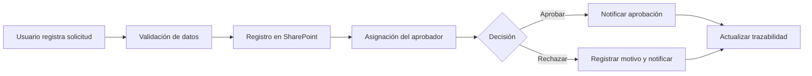

# Gestión de solicitudes con Microsoft Power Platform

Proyecto de portafolio que documenta una solución para registrar, aprobar y dar seguimiento a solicitudes internas utilizando Power Apps, Power Automate, SharePoint y Microsoft 365.

## ¿Por qué se publicó hoy?

Esta versión se publicó el **21 de julio de 2026** para convertir una experiencia de trabajo en un ejemplo reproducible, fácil de revisar durante un proceso de selección y útil como referencia técnica. La fecha corresponde a la publicación y documentación en GitHub; no pretende indicar que toda la solución original se haya desarrollado hoy.

Los nombres, personas y registros de la demostración son ficticios. No se incluye información confidencial ni archivos de una organización real.

## Problema que resuelve

Las solicitudes llegaban por correo o se registraban en archivos de Excel. Esto hacía difícil saber quién debía atenderlas, cuánto tiempo llevaban pendientes y qué decisión se había tomado. La solución concentra la información en un solo lugar y deja trazabilidad de cada cambio.

## Herramientas utilizadas

- **Power Apps:** formulario de registro y pantalla de seguimiento.
- **SharePoint Lists:** almacenamiento de solicitudes e historial.
- **Power Automate:** aprobación, notificaciones, recordatorios y escalamiento.
- **Outlook y Teams:** avisos a solicitantes y responsables.
- **Power BI (opcional):** indicadores de volumen y tiempos de atención.

## Flujo principal



## Contenido del repositorio

```text
gestion-solicitudes-power-platform/
├── demo/                         Demo local del proceso
├── docs/                         Arquitectura y modelo de datos
├── power-apps/                   Fórmulas Power Fx comentadas
├── power-automate/               Diseño de los flujos
└── sharepoint/                   Script de creación de listas
```

## Probar la demo

No requiere instalación. Abra `demo/index.html` en un navegador. La demo permite:

1. Registrar una solicitud.
2. Consultar el estado y el historial.
3. Aprobar o rechazar solicitudes pendientes.
4. Conservar los datos en el navegador mediante `localStorage`.

La demo representa el proceso y la experiencia de usuario. La implementación productiva se realiza con los componentes de Microsoft descritos en las carpetas técnicas.

## Implementación en Microsoft 365

1. Crear las listas con [`sharepoint/crear-listas.ps1`](sharepoint/crear-listas.ps1).
2. Crear una aplicación Canvas y adaptar las fórmulas de [`power-apps/formulas-power-fx.md`](power-apps/formulas-power-fx.md).
3. Configurar los flujos descritos en [`power-automate/flujo-aprobacion.md`](power-automate/flujo-aprobacion.md).
4. Asignar permisos por rol y realizar pruebas con usuarios.
5. Publicar la aplicación y monitorear tiempos de atención.

## Resultados observados

- Un único punto para registrar y consultar solicitudes.
- Menos seguimiento manual por correo y Excel.
- Historial de decisiones y comentarios por solicitud.
- Recordatorios automáticos para casos pendientes.
- Información disponible para medir carga y tiempos de atención.

No se publican porcentajes inventados. En una implementación real, los resultados deben respaldarse comparando la línea base con los indicadores posteriores a la puesta en producción.

## Autor

Hernán Troya — [GitHub](https://github.com/htroya)
